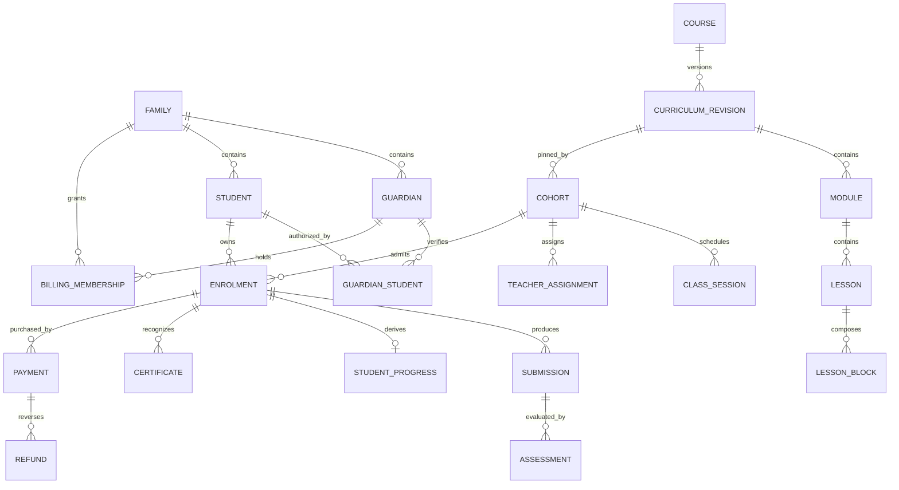

# Domain model

Status: DRAFT. Architecture version1.0. This is a complete proposed launch blueprint for human review. No application code is implemented. Canonical machine-readable details: [backend-catalog.json](backend-catalog.json). Requirement authority: [requirements.json](../product/requirements.json). Implementing chunk IDs are assigned by the consolidated Code Blueprint and requirement-to-chunk traceability; no catalog entry may be implemented without that assignment.

The model distinguishes educational content from its delivery. Program optionally groups Courses. A Course is reusable curriculum and published marketing metadata. Each CurriculumRevision owns ordered Modules, Lessons, typed LessonBlocks, resources and assessment definitions. A published revision is immutable. A Cohort is a scheduled delivery pinned to exactly one published revision of its Course. A ClassSession is one dated occurrence in that Cohort. Adding another cohort never duplicates curriculum. Revising curriculum creates a new revision; existing cohorts retain their pin.

A Guardian is an adult profile attached to Account. GuardianStudent is an explicit verified and revocable educational relationship. Membership of a family alone never grants access to every child in it. BillingMembership is separately granted adult financial access; sharing guardianship alone never exposes unrelated purchase history. Child registration creates the new StudentProfile and initial relationship transactionally, so a childless family is a valid state. Students have required name and numeric age with an as-of date, optional school and no required email. Staff invitations and guardian-provisioned child credentials create purpose-limited identities; no self-service staff role grants exist.

An Enrolment binds one student to one cohort, reservation state and educational entitlement. Payment stores an immutable price/merchant/tax purchase snapshot and provider references. Payment success and educational activation are different facts: an authoritative verified payment can become a paid exception if a hold expired and capacity is exhausted. Finance admin resolves it once through locked ALLOCATE or REFUND; a refund reservation prevents later allocation. Cancelling educational access never silently deletes money and refund outcome never silently decides access: KEEP/CANCEL is explicit.

Assessment definitions live in the revision; student work is independently versioned. QuizAttempt holds its own snapshot and selections, freezes on submit and releases score, per-question correctness and approved explanation. Unsubmitted quizzes never disclose keys. Submission freezes a draft and its ready file references; return creates a new attempt rather than rewriting history. Assessment and TeacherFeedback have draft, released and withdrawn states. Release is an explicit use case that triggers notifications and progress recomputation.

StudentProgress is derived from required lesson/activity acknowledgements, passing quizzes/assessments and delivered non-cancelled attendance. Standard completion requires every required item and at least80% attended delivered sessions. An education-admin CompletionOverride can confer eligibility only with evidence and reason; it does not alter source counts or grades. Certificate represents the single launch achievement, with immutable issued snapshots, revocation and reissue lineage. No points, badges, social network or AI tutoring domain is included.

Cross-cutting policy objects are FamilyOwnershipPolicy, TeachingAccessPolicy, PublicationPolicy, ReleasePolicy, SchedulePolicy, CapacityPolicy, CompletionPolicy, AudiencePolicy and FileAccessPolicy. They are pure decisions over explicit context. Clock, repositories, provider ports and UnitOfWork keep domain behavior independent of frameworks. Domain methods raise explicit failures; application services choose HTTP and operational outcomes.
