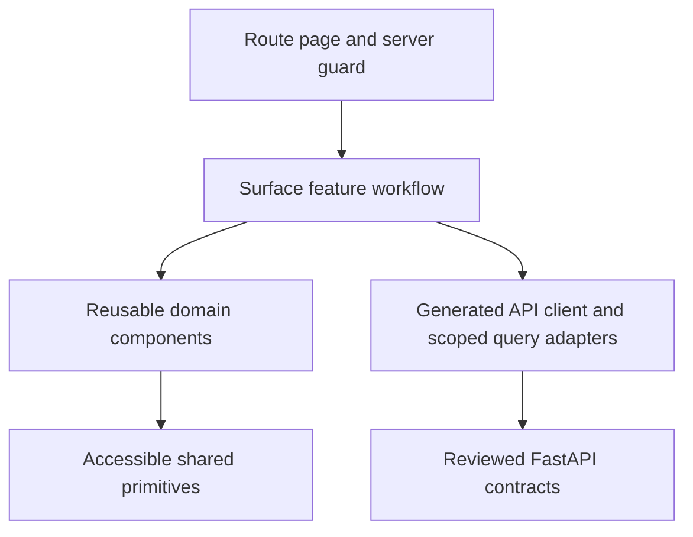

# Frontend architecture

Status: DRAFT. Scope version 1.0; architecture version 1. Backend design and its independent review precede this frontend design. This document specifies implementation; no application features are implemented by bootstrap.

The authoritative frontend inventory is [frontend-catalog.json](frontend-catalog.json). Its routes, components, API bindings and composition edges form the implementation boundary. Exact request/response fields, service operations and authorization rules remain in [backend-catalog.json](backend-catalog.json) and [API_CATALOG](API_CATALOG.md). No screen may invent a new endpoint, broaden a projection or use a worker/provider ingress operation as a browser API.

## One application, five surfaces

Use one Next.js App Router application with strict TypeScript, Tailwind design tokens and accessible shadcn/ui primitives. Public, Parent, Student, Teacher and Admin are route and feature boundaries within this application. Shared authentication and presentation plumbing do not create a sixth product or a second backend. The FastAPI service remains the sole authority for role, ownership, assignment, publication, pricing, payment, grading, release and completion.

| Surface | Main experience | Data and navigation boundary |
|---|---|---|
| Public | Approved business information, programs/courses, outcomes, age information, prices, cohort timetables, instructor biographies, policies, contact and enrolment entry | Published safe DTOs only; no family, learner, operational or payment-record hydration |
| Parent | Family and linked children, verified contacts/consent, enrolment and hosted checkout, independent billing membership, child schedules and released educational results, certificates and notices | Active guardian link per child; financial membership checked separately; a childless family is a valid starting state |
| Student | Learn → Attend/Watch → Try → Build → Submit → Review, with own courses, activities, assignments, results and certificates | Own eligible enrolments and released pinned content; no billing, family administration, peer records or teacher-private fields |
| Teacher | Assigned teaching plan, cohort/class schedule, necessary learner profiles, attendance, host start, permitted rescheduling and work review | Current teaching assignments and educational purpose; no financial features, clients, DTOs or queries in this feature graph |
| Admin | Capability-specific identity, curriculum, delivery, education, finance, communication, settings, audit and operational workspaces | Exact identity_admin, education_admin, finance_admin, operations_admin or audit_admin privilege; combined privileges only where the backend explicitly requires them |

A verified full SessionView selects the appropriate role landing page. An administrator with only audit_admin lands on the permitted audit workspace rather than requesting a dashboard whose API does not authorize that privilege. A teacher account cannot gain a finance navigation mode by adding an admin role. Separate administrator credentials and MFA are required by the backend model.

## Rendering and composition

Route pages establish server-side session/route guards, validated path context, headings and initial query boundaries. They compose feature components rather than embedding business workflows in large JSX files. Features orchestrate named API operations, forms and response states. Domain components render meaningful shared educational or scheduling concepts. Shared UI primitives own labels, focus, layout and feedback without importing any role-feature tree.

The durable names and inputs are specified in FRONTEND_COMPONENT_CATALOG. Examples of approved reuse include AppShell, RoleNavigation, PageHeader, AsyncBoundary, FormFields, ConfirmActionDialog, ResourceTable, ScheduleView, UploadControl, ProtectedDownloadAction, ProgressSummary, ReleasedResultView and CertificateCard. Shared components accept least-data DTOs and explicit callbacks; a ScheduleView with read-only input does not acquire scheduling permission from its reuse in an administrative page.

LessonRenderer dispatches the closed eight block kinds: Heading, RichText, Image, Video, Download, Activity, Quiz reference and Assignment reference. Variant renderers validate their expected payload branch, preserve ordering and provide accessible semantic output. Student mode cannot receive an authoring DTO with answer keys or unpublished material. Teacher teaching mode can reuse the presentation without importing student mutation clients; permitted actions are injected through a narrow adapter. Draft authoring uses its separate curriculum editor contracts.

Component `composition`/`reuses` names are concrete dependency edges. A consuming chunk waits for the implementing chunk of each reused durable component. Sharing LessonRenderer with teacher teaching plans therefore requires the recorded cross-chunk dependency until ownership is deliberately reassigned through the blueprint. Data-only shared primitives belong to ZE-P09-C01 to avoid unnecessary dependencies between business features. Do not copy a component to evade an honest dependency.

## Server and client responsibilities

Use Server Components for route composition, approved public content and request-scoped initial data loading. Client Components are limited to interactive forms, table filters, upload progress, quiz/submission drafts, accessible dialogs and query-driven changes. A server-side loader forwards only the current request's session context to the same-origin API; it is not a new privileged data service. No Next.js route handler, Server Action or client helper may duplicate a FastAPI business rule or directly query PostgreSQL/provider APIs.

Native fetch is the transport underneath generated typed operation clients. TanStack Query v5 manages browser server-state queries and mutation invalidation; React component state manages ephemeral presentation and unsaved form drafts. There is no Redux-style copy of the authoritative entity database. The initial route may prefetch and hydrate the same scoped query keys used by the client. Every server request gets a separate query client; private state is never held in a process-global server cache. Private route/data responses use no-store and are excluded from public/static regeneration caches.

These framework choices follow the official guidance for [Next.js Server and Client Components](https://nextjs.org/docs/app/getting-started/server-and-client-components) and [TanStack Query server rendering](https://tanstack.com/query/latest/docs/framework/react/guides/advanced-ssr). The role isolation and no-store rules are Zuno's deliberate security requirements.

Public content can use a bounded publication-aware cache. Private account, child, work, payment, MFA and provider-handoff data cannot use that cache. Public pages do not fetch private data merely to decide whether to show a sign-in link. Large editor/upload/player code is loaded only by the route requiring it. Teacher/student chunks cannot import the administrative finance tree, including through a common barrel export.

## Package and import boundaries

Approved implementation areas are the route tree under `apps/web/src/app`, feature areas under `apps/web/src/features/<surface>`, shared presentation under `apps/web/src/components/shared`, and generated contracts/transport under the shared API package selected by the Code Blueprint. Exact component module paths come from frontend-catalog.json. Foundation adapters centralize credentials, CSRF, errors, query-key construction and contract serialization. They expose named operation subsets rather than a universal endpoint builder accepting arbitrary paths.

Each role supplies its navigation registry to AppShell. AppShell does not import every role page. Feature clients import only the operations declared for that feature. An education administrator selects approved active teachers through API-ADMIN-TEACHING-CANDIDATES, receiving id/display_name only. The identity-admin teacher directory remains separate. Selectors use names and returned opaque references internally; users are not asked to type arbitrary IDs. If a needed selector contract is absent, that is a blueprint conflict, not permission to invent a lookup or broaden an unrelated API.

Admin pages are segmented by capability. A combined dashboard loads only authorized parts; a finance-only administrator does not trigger curriculum or child-work calls. Stripe configuration/replay controls respect the documented combined operations and finance privilege. Audit-only users do not fetch financial reports. Frontend checks improve navigation and feedback, while every API still reauthorizes independently.

## Forms and authoritative outcomes

Forms derive field types, nullability, closed enums and validation messages from generated API contracts. Parent child registration visibly requires name and age; school, surname and preferred name remain optional. Student self-edit includes only the reviewed safe display/interests/experience fields. No form adds child email, DOB, diagnosis or unrestricted sensitive notes. Optional blank values, explicit null and PATCH omission remain different states.

Money display formats server-supplied integer AUD amounts. Checkout keeps a selected child/course/cohort and approved return path, creates the server-priced session and navigates only to the returned hosted checkout URL. The return screen reads authoritative PaymentView; it never activates an enrolment or infers payment success from URL parameters. Price changes, expired holds, full cohorts, pending/failed payment and paid exceptions have explicit backend-driven states.

Teacher marking saves a draft independently of release. Release/withdrawal, reschedule/cancel, account/role changes, refunds, completion overrides and certificate actions use deliberate confirmation and required reason/evidence controls. A typed evidence reference is sent for server verification; the UI does not treat arbitrary text as approved evidence. Published curriculum and frozen submitted work are visibly immutable; revisions use the corresponding create/copy/return lifecycle operation.

The upload experience shows selection, transfer, quarantine/scanning, ready or rejection. Browsers do not approve a file based on a completed PUT or a declared MIME type. Only a ready asset from the authorized file API can be attached to work. Financial documents and finance exports use their dedicated finance-authorized retrieval operations; the generic learning-file route remains unavailable for financial purposes.

## Accessibility and responsive behavior

Meet the repository WCAG 2.2 AA acceptance target across all five surfaces. Preserve one meaningful page heading, semantic landmarks, visible keyboard focus, labels/descriptions, associated errors and live status. Dialog focus is trapped and returned to its trigger. Reordering has keyboard move controls even if pointer drag is also offered. Tables retain header associations and provide labelled mobile alternatives. No essential action depends on hover, color or a precise pointer gesture.

Student instructions use short steps and clear saved/submitted/released language. Quiz questions use labelled radio/checkbox groups, support paste and ordinary keyboard navigation, and do not introduce an unsupported timer. Video includes captions or transcript; images have meaningful alternatives. Respect reduced motion and zoom/reflow. Announce important upload/result changes, not every polling tick or transferred byte. Tests combine automated accessibility checks with manual keyboard and screen-reader journeys.

## Implementation and verification boundary

Shared/public/auth work maps to ZE-P09. Parent/student work maps to ZE-P10. Teacher/admin work maps to ZE-P11, including the reviewed separation of public/catalogue editing, curriculum/block/resource editing and quiz/assignment definition editing. Exact route/component chunks are canonical in the frontend catalog and chunk manifests; this narrative does not merge their implementation scope.

Verification must prove route guards and direct API denial, actual response-field absence, revoked relationship handling, no private shared cache, MFA limited-context isolation, stale version recovery, payment-return truth, scan-gated attachments, released-result visibility, protected download expiry and teacher/student finance import exclusion. Every component-operation pair maps to the same reviewed service, objects, ports and persistence as the backend catalog. New durable frontend components or APIs require a requirement and blueprint/chunk mapping before implementation.
