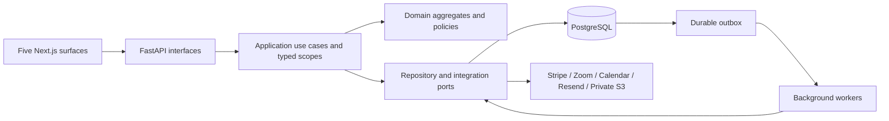

# System architecture

Status: DRAFT. Architecture version1.0. This is a complete proposed launch blueprint for human review. No application code is implemented. Canonical machine-readable details: [backend-catalog.json](backend-catalog.json). Requirement authority: [requirements.json](../product/requirements.json). Implementing chunk IDs are assigned by the consolidated Code Blueprint and requirement-to-chunk traceability; no catalog entry may be implemented without that assignment.

Zuno Edu is one modular monolith with five surfaces: Public, Parent, Student, Teacher and Admin. One Next.js application calls one versioned FastAPI application. PostgreSQL is the authoritative store for identities, relationships, curriculum, delivery, learning records, money, permissions and integration intent. Redis provides disposable queue/cache acceleration. A separately deployed worker process runs the same application use cases with explicit internal identities. No product features are implemented by this planning run.

The same origin serves web and `/api/v1`; secure cookies and CSRF defenses protect state-changing browser operations. The backend is the sole decision maker for role, ownership, assignment, release, price, capacity and state transitions. Each surface receives whitelisted DTO projections. Admin privileges are identity_admin, education_admin, finance_admin, operations_admin and audit_admin. A teacher principal cannot acquire any financial privilege through additive roles; a separate administrator principal with MFA is mandatory.

Each capability module owns its aggregates and repository interfaces. Modules exchange immutable IDs, narrow typed contracts and committed events. They never reach into another module's ORM model or Redis cache as authority. Application composition configures concrete adapters once at the entrypoint. Infrastructure is replaceable and contains no authorization policy exceptions.

Three consistency patterns are approved. Local business invariants use one PostgreSQL transaction with row/version locks and unique constraints. External side effects use durable outbox/inbox records and idempotency, with provider calls outside lock-held transactions. Read models use scoped PostgreSQL joins and rebuildable projections. There is no distributed transaction and no browser-side fulfilment.

The planned OCI-compatible Docker/Caddy deployment, integrations and operating gates are detailed in DEPLOYMENT_ARCHITECTURE and the provider architecture documents. Technology direction is deliberately independent of the initial host. Scope, code blueprint, API and chunk traceability are repository authority after human approval and remote merge; private helpers cannot mutate that authority.
