# Dependency graph

Immediate prerequisites after cycle validation and transitive reduction. Phase numbers group capabilities, not a mandatory serial gate. Frontend includes actual API and reused-component dependencies. The final gate requires every other chunk.

```mermaid
flowchart TD
  ZE_P01_C01["ZE-P01-C01"]
  ZE_P01_C01 --> ZE_P01_C02
  ZE_P01_C01 --> ZE_P01_C03
  ZE_P01_C02 --> ZE_P02_C01
  ZE_P01_C03 --> ZE_P02_C01
  ZE_P02_C01 --> ZE_P02_C02
  ZE_P02_C02 --> ZE_P02_C03
  ZE_P02_C02 --> ZE_P02_C04
  ZE_P02_C03 --> ZE_P02_C05
  ZE_P02_C02 --> ZE_P03_C01
  ZE_P02_C02 --> ZE_P03_C02
  ZE_P03_C02 --> ZE_P03_C03
  ZE_P03_C03 --> ZE_P03_C04
  ZE_P04_C02 --> ZE_P03_C04
  ZE_P02_C02 --> ZE_P04_C01
  ZE_P04_C01 --> ZE_P04_C02
  ZE_P02_C03 --> ZE_P05_C01
  ZE_P02_C04 --> ZE_P05_C01
  ZE_P03_C02 --> ZE_P05_C01
  ZE_P05_C01 --> ZE_P05_C02
  ZE_P05_C02 --> ZE_P05_C03
  ZE_P06_C02 --> ZE_P05_C03
  ZE_P05_C02 --> ZE_P05_C04
  ZE_P08_C02 --> ZE_P05_C04
  ZE_P05_C02 --> ZE_P05_C05
  ZE_P06_C02 --> ZE_P05_C05
  ZE_P05_C01 --> ZE_P06_C01
  ZE_P02_C05 --> ZE_P06_C02
  ZE_P06_C01 --> ZE_P06_C02
  ZE_P06_C02 --> ZE_P06_C03
  ZE_P04_C02 --> ZE_P06_C04
  ZE_P06_C03 --> ZE_P06_C04
  ZE_P06_C04 --> ZE_P06_C05
  ZE_P03_C03 --> ZE_P07_C01
  ZE_P06_C02 --> ZE_P07_C01
  ZE_P03_C03 --> ZE_P07_C02
  ZE_P04_C02 --> ZE_P07_C03
  ZE_P06_C02 --> ZE_P07_C03
  ZE_P07_C02 --> ZE_P07_C03
  ZE_P07_C03 --> ZE_P07_C04
  ZE_P05_C05 --> ZE_P07_C05
  ZE_P07_C01 --> ZE_P07_C05
  ZE_P07_C04 --> ZE_P07_C05
  ZE_P07_C05 --> ZE_P07_C06
  ZE_P02_C03 --> ZE_P08_C01
  ZE_P03_C01 --> ZE_P08_C02
  ZE_P05_C01 --> ZE_P08_C02
  ZE_P08_C01 --> ZE_P08_C02
  ZE_P08_C01 --> ZE_P08_C03
  ZE_P06_C05 --> ZE_P08_C04
  ZE_P07_C06 --> ZE_P08_C04
  ZE_P05_C04 --> ZE_P08_C05
  ZE_P08_C04 --> ZE_P08_C05
  ZE_P02_C01 --> ZE_P09_C01
  ZE_P02_C05 --> ZE_P09_C02
  ZE_P05_C02 --> ZE_P09_C02
  ZE_P06_C01 --> ZE_P09_C02
  ZE_P08_C02 --> ZE_P09_C02
  ZE_P09_C01 --> ZE_P09_C02
  ZE_P02_C05 --> ZE_P09_C03
  ZE_P09_C01 --> ZE_P09_C03
  ZE_P09_C03 --> ZE_P10_C01
  ZE_P03_C01 --> ZE_P10_C02
  ZE_P06_C04 --> ZE_P10_C02
  ZE_P10_C01 --> ZE_P10_C02
  ZE_P05_C03 --> ZE_P10_C03
  ZE_P05_C04 --> ZE_P10_C03
  ZE_P07_C06 --> ZE_P10_C03
  ZE_P10_C01 --> ZE_P10_C03
  ZE_P03_C04 --> ZE_P10_C04
  ZE_P07_C05 --> ZE_P10_C04
  ZE_P09_C03 --> ZE_P10_C04
  ZE_P10_C04 --> ZE_P10_C05
  ZE_P07_C06 --> ZE_P10_C06
  ZE_P10_C05 --> ZE_P10_C06
  ZE_P05_C03 --> ZE_P10_C07
  ZE_P08_C02 --> ZE_P10_C07
  ZE_P10_C04 --> ZE_P10_C07
  ZE_P05_C03 --> ZE_P11_C01
  ZE_P08_C02 --> ZE_P11_C01
  ZE_P10_C04 --> ZE_P11_C01
  ZE_P11_C01 --> ZE_P11_C02
  ZE_P02_C04 --> ZE_P11_C03
  ZE_P09_C03 --> ZE_P11_C03
  ZE_P03_C01 --> ZE_P11_C04
  ZE_P03_C03 --> ZE_P11_C04
  ZE_P09_C03 --> ZE_P11_C04
  ZE_P03_C04 --> ZE_P11_C09
  ZE_P07_C01 --> ZE_P11_C09
  ZE_P07_C02 --> ZE_P11_C09
  ZE_P09_C03 --> ZE_P11_C09
  ZE_P07_C01 --> ZE_P11_C10
  ZE_P07_C02 --> ZE_P11_C10
  ZE_P09_C03 --> ZE_P11_C10
  ZE_P05_C03 --> ZE_P11_C05
  ZE_P05_C04 --> ZE_P11_C05
  ZE_P05_C05 --> ZE_P11_C05
  ZE_P07_C02 --> ZE_P11_C05
  ZE_P09_C03 --> ZE_P11_C05
  ZE_P07_C06 --> ZE_P11_C06
  ZE_P09_C03 --> ZE_P11_C06
  ZE_P06_C05 --> ZE_P11_C07
  ZE_P09_C03 --> ZE_P11_C07
  ZE_P08_C02 --> ZE_P11_C08
  ZE_P08_C03 --> ZE_P11_C08
  ZE_P08_C04 --> ZE_P11_C08
  ZE_P09_C03 --> ZE_P11_C08
  ZE_P08_C03 --> ZE_P12_C01
  ZE_P12_C01 --> ZE_P12_C02
  ZE_P02_C05 --> ZE_P12_C03
  ZE_P04_C02 --> ZE_P12_C03
  ZE_P12_C01 --> ZE_P12_C03
  ZE_P12_C02 --> ZE_P12_C04
  ZE_P08_C05 --> ZE_P12_C05
  ZE_P09_C02 --> ZE_P12_C05
  ZE_P10_C02 --> ZE_P12_C05
  ZE_P10_C03 --> ZE_P12_C05
  ZE_P10_C06 --> ZE_P12_C05
  ZE_P10_C07 --> ZE_P12_C05
  ZE_P11_C02 --> ZE_P12_C05
  ZE_P11_C03 --> ZE_P12_C05
  ZE_P11_C04 --> ZE_P12_C05
  ZE_P11_C05 --> ZE_P12_C05
  ZE_P11_C06 --> ZE_P12_C05
  ZE_P11_C07 --> ZE_P12_C05
  ZE_P11_C08 --> ZE_P12_C05
  ZE_P11_C09 --> ZE_P12_C05
  ZE_P11_C10 --> ZE_P12_C05
  ZE_P12_C03 --> ZE_P12_C05
  ZE_P12_C04 --> ZE_P12_C05
  ZE_P12_C05 --> ZE_P12_C06
  ZE_P12_C06 --> ZE_P12_C07
```

- ZE-P01-C01: no chunk prerequisite
- ZE-P01-C02: ZE-P01-C01
- ZE-P01-C03: ZE-P01-C01
- ZE-P02-C01: ZE-P01-C02, ZE-P01-C03
- ZE-P02-C02: ZE-P02-C01
- ZE-P02-C03: ZE-P02-C02
- ZE-P02-C04: ZE-P02-C02
- ZE-P02-C05: ZE-P02-C03
- ZE-P03-C01: ZE-P02-C02
- ZE-P03-C02: ZE-P02-C02
- ZE-P03-C03: ZE-P03-C02
- ZE-P03-C04: ZE-P03-C03, ZE-P04-C02
- ZE-P04-C01: ZE-P02-C02
- ZE-P04-C02: ZE-P04-C01
- ZE-P05-C01: ZE-P02-C03, ZE-P02-C04, ZE-P03-C02
- ZE-P05-C02: ZE-P05-C01
- ZE-P05-C03: ZE-P05-C02, ZE-P06-C02
- ZE-P05-C04: ZE-P05-C02, ZE-P08-C02
- ZE-P05-C05: ZE-P05-C02, ZE-P06-C02
- ZE-P06-C01: ZE-P05-C01
- ZE-P06-C02: ZE-P02-C05, ZE-P06-C01
- ZE-P06-C03: ZE-P06-C02
- ZE-P06-C04: ZE-P04-C02, ZE-P06-C03
- ZE-P06-C05: ZE-P06-C04
- ZE-P07-C01: ZE-P03-C03, ZE-P06-C02
- ZE-P07-C02: ZE-P03-C03
- ZE-P07-C03: ZE-P04-C02, ZE-P06-C02, ZE-P07-C02
- ZE-P07-C04: ZE-P07-C03
- ZE-P07-C05: ZE-P05-C05, ZE-P07-C01, ZE-P07-C04
- ZE-P07-C06: ZE-P07-C05
- ZE-P08-C01: ZE-P02-C03
- ZE-P08-C02: ZE-P03-C01, ZE-P05-C01, ZE-P08-C01
- ZE-P08-C03: ZE-P08-C01
- ZE-P08-C04: ZE-P06-C05, ZE-P07-C06
- ZE-P08-C05: ZE-P05-C04, ZE-P08-C04
- ZE-P09-C01: ZE-P02-C01
- ZE-P09-C02: ZE-P02-C05, ZE-P05-C02, ZE-P06-C01, ZE-P08-C02, ZE-P09-C01
- ZE-P09-C03: ZE-P02-C05, ZE-P09-C01
- ZE-P10-C01: ZE-P09-C03
- ZE-P10-C02: ZE-P03-C01, ZE-P06-C04, ZE-P10-C01
- ZE-P10-C03: ZE-P05-C03, ZE-P05-C04, ZE-P07-C06, ZE-P10-C01
- ZE-P10-C04: ZE-P03-C04, ZE-P07-C05, ZE-P09-C03
- ZE-P10-C05: ZE-P10-C04
- ZE-P10-C06: ZE-P07-C06, ZE-P10-C05
- ZE-P10-C07: ZE-P05-C03, ZE-P08-C02, ZE-P10-C04
- ZE-P11-C01: ZE-P05-C03, ZE-P08-C02, ZE-P10-C04
- ZE-P11-C02: ZE-P11-C01
- ZE-P11-C03: ZE-P02-C04, ZE-P09-C03
- ZE-P11-C04: ZE-P03-C01, ZE-P03-C03, ZE-P09-C03
- ZE-P11-C09: ZE-P03-C04, ZE-P07-C01, ZE-P07-C02, ZE-P09-C03
- ZE-P11-C10: ZE-P07-C01, ZE-P07-C02, ZE-P09-C03
- ZE-P11-C05: ZE-P05-C03, ZE-P05-C04, ZE-P05-C05, ZE-P07-C02, ZE-P09-C03
- ZE-P11-C06: ZE-P07-C06, ZE-P09-C03
- ZE-P11-C07: ZE-P06-C05, ZE-P09-C03
- ZE-P11-C08: ZE-P08-C02, ZE-P08-C03, ZE-P08-C04, ZE-P09-C03
- ZE-P12-C01: ZE-P08-C03
- ZE-P12-C02: ZE-P12-C01
- ZE-P12-C03: ZE-P02-C05, ZE-P04-C02, ZE-P12-C01
- ZE-P12-C04: ZE-P12-C02
- ZE-P12-C05: ZE-P08-C05, ZE-P09-C02, ZE-P10-C02, ZE-P10-C03, ZE-P10-C06, ZE-P10-C07, ZE-P11-C02, ZE-P11-C03, ZE-P11-C04, ZE-P11-C05, ZE-P11-C06, ZE-P11-C07, ZE-P11-C08, ZE-P11-C09, ZE-P11-C10, ZE-P12-C03, ZE-P12-C04
- ZE-P12-C06: ZE-P12-C05
- ZE-P12-C07: ZE-P12-C06
